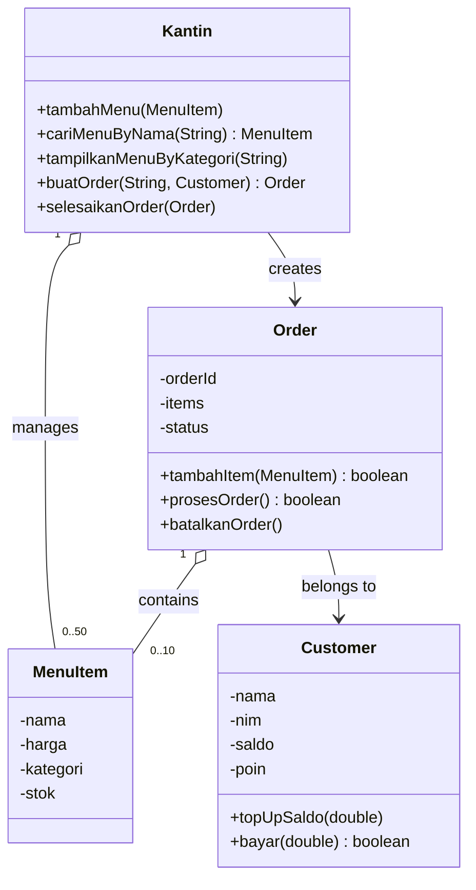

# GarudaEats Class Diagram

```mermaid
classDiagram
    class Kantin {
      +tambahMenu(MenuItem)
      +cariMenuByNama(String) MenuItem
      +tampilkanMenuByKategori(String)
      +buatOrder(String, Customer) Order
      +selesaikanOrder(Order)
    }
    class MenuItem {
      -nama
      -harga
      -kategori
      -stok
    }
    class Customer {
      -nama
      -nim
      -saldo
      -poin
      +topUpSaldo(double)
      +bayar(double) boolean
    }
    class Order {
      -orderId
      -items
      -status
      +tambahItem(MenuItem) boolean
      +prosesOrder() boolean
      +batalkanOrder()
    }
    Kantin "1" o-- "0..50" MenuItem : manages
    Kantin --> Order : creates
    Order --> Customer : belongs to
    Order "1" o-- "0..10" MenuItem : contains
```
